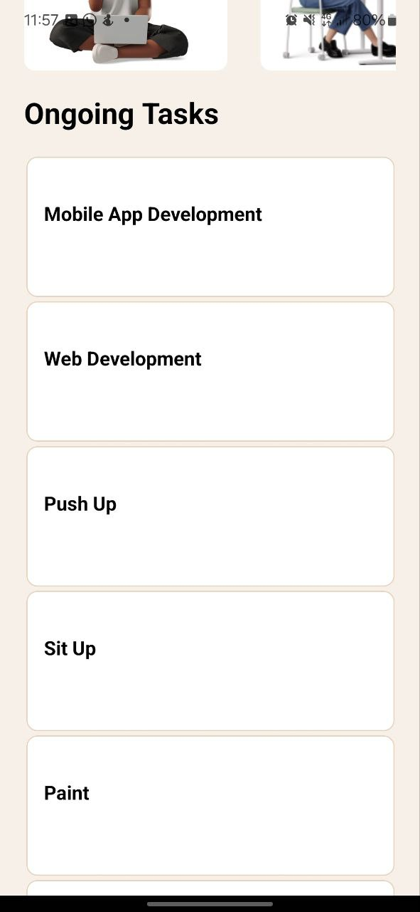

11173490
# rn-assignment-11173490
This is a React Native application for managing tasks, including various categories such as Exercise, Study, Code, Cook, and more.

## Components
View: A container component that is used to group and arrange other components.

Text: A component used to display text content.

ScrollView: A scrollable container that allows users to scroll through a list of components.

TextInput: A component used to capture user input through a keyboard.

Stylesheet: A module that provides a way to define styles for components using JavaScript objects.

Button: A component used to create a clickable button.

FlatList: A component used to render a scrollable list of items where all the items are rendered at once.

## Screenshots

